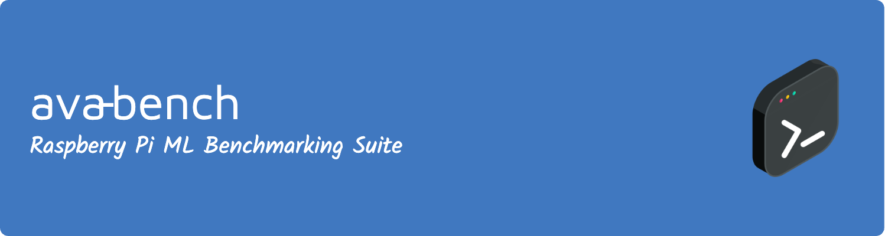

<div align="center">
  
</div>

**⚠️ Currently in Development**
# 

AVA-Bench is a comprehensive command-line ML benchmarking suite designed specifically for Raspberry Pi devices. It provides automated performance evaluation and detailed profiling of machine learning workloads across different Pi models and configurations.

## Overview

AVA-Bench automatically detects your Raspberry Pi hardware specifications and runs comprehensive benchmarks to evaluate ML performance capabilities. The tool supports multiple ML frameworks and provides detailed insights into inference performance, system resource utilization, and thermal behavior.

### Key Features

- **Automatic Hardware Detection**: Identifies Pi model, RAM, and available accelerators (Coral TPU, AI Kit)
- **Framework Agnostic**: Supports TensorFlow Lite, PyTorch, OpenCV, and more
- **Comprehensive Profiling**: CPU utilization, memory analysis, thermal monitoring
- **Advanced Visualizations**: ML-enhanced flame graphs with operation categorization
- **Batch Testing**: YAML-based configuration system for automated test sweeps
- **Headless Ready**: Pure terminal interface ideal for automated workflows

### Sample Benchmark Configuration

```yaml
sweep:
  name: "pi5_comprehensive_analysis"
  method: "grid"
parameters:
  framework: ["tensorflow_lite", "pytorch", "opencv"]
  model: ["mobilenet_v2", "yolov8n", "efficientnet_lite"]
  precision: ["fp32", "int8"]
  threads: [1, 2, 4]
  batch_size: [1, 4, 8]
profiling:
  enable_flame_graphs: true
  memory_profiling: true
  thermal_monitoring: true
constraints:
  max_temperature: 80
  max_power: 15W
```

## Coming Soon

- Layer-level neural network profiling
- Roofline model analysis integration
- Real-time performance monitoring
- Power consumption analysis

---

*do not use this code for now*
